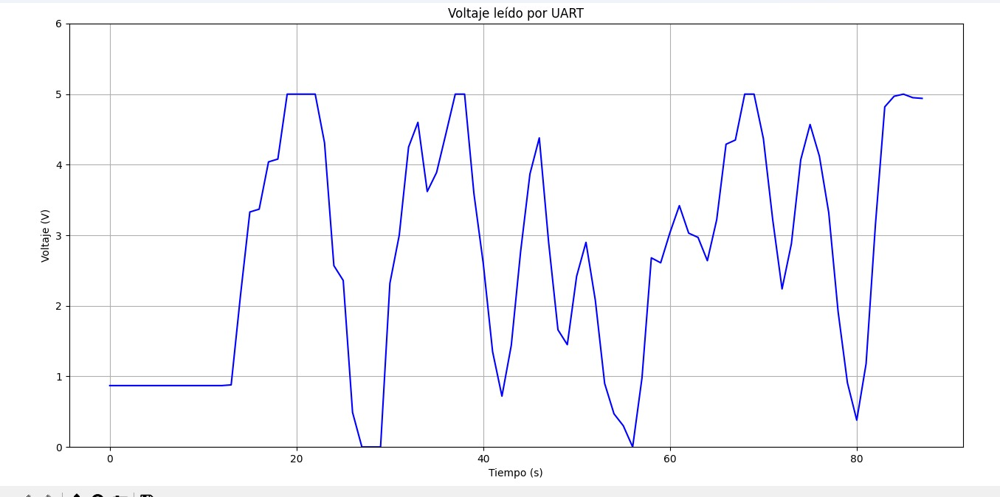
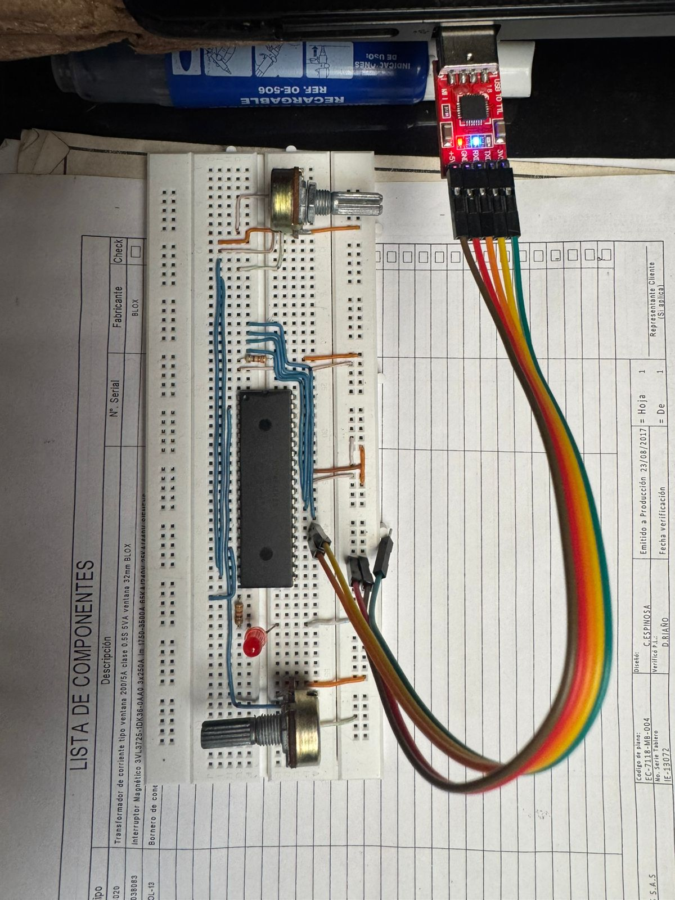

# Lab04: Comunicación UART en PIC18F45K22

## Integrantes
 
  Juan David Bernal Bernal

## Documentación
   
   ## Introduccion 
     
     Este  
     

   
  Imagen.1 Grafica de voltaje expresada en el dominio del tiempo diseñada en Python.

## Implmentación
  
  
 Imagen.2 Montaje usando el conversor srial USB a Serial TTL.
   
 