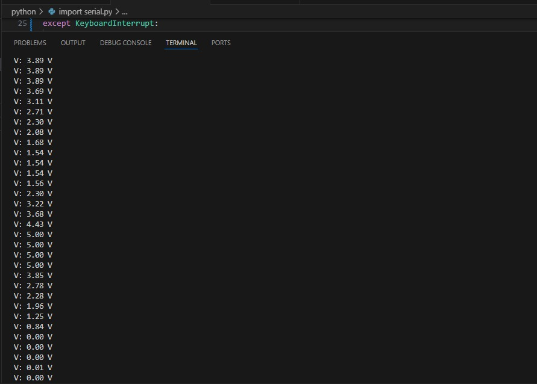

# Lab04: Comunicación UART en PIC18F45K22

## Integrantes
 
  Juan David Bernal Bernal

## Documentación
   
  ## Introduccion 
     
  En este laboratorio abordaremos la implementación y configuración del protocolo de comunicación serial UART (Universal Asynchronous Receiver-Transmitter) que nos permite establecer comunicación bidireccional entre nuestro microcontrolador PIC18F45K22 y dispositivos externos como computadoras, módulos o otros microcontroladores. UART es un protocolo de comunicación asíncrono que transmite datos de forma serial bit a bit sin necesidad de una señal de reloj compartida, utilizando únicamente dos líneas: TX (transmisión) y RX (recepción), lo que lo convierte en una solución eficiente para aplicaciones que requieren intercambio de información a distancias considerables con un mínimo de conexiones físicas.

  Hemos configurado a nivel hardware nuestro PIC18F45K22 utilizando el oscilador interno a 16MHz para optimizar la precisión en la generación del baud rate, empleando específicamente los pines RC6 como TX (transmisión) y RC7 como RX (recepción) del módulo EUSART1 integrado en el microcontrolador. La configuración del UART se establece a 9600 baudios en modo asíncrono de 8 bits, sin paridad y con un bit de parada, utilizando el registro SPBRG1 con un valor de 25 para alcanzar la velocidad de transmisión deseada. Para demostrar la funcionalidad práctica del sistema, hemos integrado el módulo ADC configurado en el pin RA0 (AN0) que nos permitirá leer señales analógicas y convertir estos valores a voltaje, transmitiendo posteriormente esta información formateada a través del puerto serie utilizando la función sprintf para crear cadenas de texto estructuradas que incluyen el valor del voltaje con dos decimales de precisión.

 El desarrollo de esta práctica se realizará mediante el software MPLAB X IDE en la versión V6.15 y como programador utilizaremos el PICKIT-4, herramientas que nos permitirán compilar, programar y depurar nuestro código, donde previamente describiremos las funciones implementadas y sus funcionalidades para establecer una comunicación serial efectiva entre el microcontrolador y el terminal de la computadora. 

  ## Desarrollo de la practica
  
  ## Implementación y Configuración del Sistema

  Para esta práctica se basa en un montaje simple que aprovecha las capacidades del módulo EUSART1 integrado en el PIC18F45K22, donde hemos empleado únicamente los pines RC6 y RC7 para establecer la comunicación serial bidireccional con dispositivos externos. La selección de estos pines no es arbitraria, ya que están internamente conectados al módulo UART del microcontrolador, siendo RC6 configurado como TX (transmisión) y RC7 como RX (recepción) mediante las líneas de código TRISC6 = 0 y TRISC7 = 1 respectivamente, lo que permite aprovechar las funcionalidades de hardware sin necesidad de implementar protocolos de comunicación por software. Esta configuración de direcciones se complementa con la habilitación del módulo serial a través de RCSTA1bits.SPEN = 1, que automáticamente toma control de estos pines y los configura para su función UART específica. Para demostrar la funcionalidad práctica del sistema, hemos integrado un potenciómetro de 10KΩ conectado al pin RA0 que actuará como entrada analógica para el ADC, permitiendo generar datos variables que serán transmitidos a través del puerto serie hacia un terminal en la computadora.

  La configuración del baud rate constituye uno de los aspectos más críticos en la implementación del UART, ya que determina la velocidad de transmisión de datos entre el microcontrolador y el dispositivo receptor. Para calcular correctamente el valor del registro SPBRG1, empleamos la fórmula específica para el modo asíncrono de baja velocidad:
   
  $SPBRG = \frac{f_{osc}}{64 \times Baudrate} - 1$
  
   donde la implementación en código se establece mediante SPBRG1 = 25. Sustituyendo nuestros valores de oscilador interno configurado con OSCCON = 0b01110000 para 16 MHz y un baud rate deseado de 9600 bps, obtenemos:

  $SPBRG = \frac{16,000,000}{64 \times 9600} - 1 = \frac{16,000,000}{614,400} - 1 = 26.04 - 1 \approx 25$

  Este cálculo se complementa con la configuración TXSTA1bits.BRGH = 0 que selecciona el divisor de 64 para baja velocidad, y BAUDCON1bits.BRG16 = 0 que especifica el uso del generador de baud rate de 8 bits, proporcionando una velocidad de transmisión precisa y estable para la comunicación.

  La configuración de los registros UART requiere una comprensión detallada de cada bit y su función específica en el protocolo de comunicación. El registro TXSTA1 controla los aspectos de transmisión, donde la secuencia de configuración TXSTA1bits.BRGH = 0, TXSTA1bits.SYNC = 0, y TXSTA1bits.TXEN = 1 establece respectivamente el modo de baja velocidad con divisor de 64, el modo asíncrono característico del UART donde no se requiere señal de reloj compartida, y la habilitación del módulo transmisor. Paralelamente, el registro RCSTA1 maneja la recepción mediante RCSTA1bits.SPEN = 1 que habilita todo el módulo serial y automáticamente configura los pines RC6 y RC7 para su función UART, complementado con RCSTA1bits.CREN = 1 que habilita la recepción continua, permitiendo que el microcontrolador esté siempre listo para recibir datos entrantes. Esta configuración se implementa dentro de la función void UART_Init(void) que centraliza toda la inicialización del módulo y garantiza que todos los parámetros estén correctamente establecidos antes del inicio de la comunicación.

  El protocolo de comunicación se complementa con la configuración de interrupciones mediante PIE1bits.RC1IE = 1 que habilita la interrupción por recepción UART, PIR1bits.RC1IF = 0 para limpiar la bandera de interrupción, INTCONbits.PEIE = 1 que habilita interrupciones periféricas, e INTCONbits.GIE = 1 para interrupciones globales. Aunque en esta implementación básica no se procesan interrupciones de recepción, esta configuración prepara el sistema para futuras expansiones que requieran manejo de datos entrantes de manera asíncrona, demostrando las capacidades completas del módulo EUSART1 y proporcionando una base sólida para aplicaciones más complejas que puedan requerir comunicación bidireccional completa.

  ## Desarrollo de Funciones de Comunicación
  
  La implementación de las funciones de comunicación UART se diseña siguiendo un enfoque modular que facilita el mantenimiento y la reutilización del código. La función void UART_WriteChar(char data) constituye el núcleo fundamental del sistema de transmisión, implementando un mecanismo de espera activa mediante while (!TXSTA1bits.TRMT) que verifica continuamente el estado del bit TRMT (Transmit Shift Register Status). Este bit indica cuando el registro de desplazamiento de transmisión está vacío y listo para recibir un nuevo carácter desde TXREG1, garantizando que no se sobrescriban datos en proceso de transmisión mediante la línea TXREG1 = data que transfiere el carácter al registro de transmisión. Una vez confirmado que el buffer está disponible, el hardware del EUSART se encarga automáticamente de la transmisión serial bit a bit, incluyendo los bits de inicio, datos, y parada según el protocolo estándar UART.

 La función void UART_WriteString(const char* str) extiende la funcionalidad básica para permitir el envío de cadenas completas de caracteres, utilizando punteros para lograr un recorrido eficiente de la cadena mediante la implementación while (*str) { UART_WriteChar(*str++); }. Esta técnica aprovecha las características donde el puntero str se desreferencia con *str para obtener el carácter actual, y posteriormente se incrementa con str++ para avanzar al siguiente carácter, siendo significativamente más eficiente que copiar toda la cadena a una variable local ya que se trabaja directamente con la dirección de memoria original. El bucle se detiene automáticamente al encontrar el carácter nulo '\0' que marca el final de la cadena, esta implementación radica en que no requiere conocer previamente la longitud de la cadena ni utilizar índices adicionales, proporcionando una solución robusta y eficiente para la transmisión de mensajes de longitud variable.

 ## Integración con Conversión Analógica y Transmisión de Datos

 Para demostrar la funcionalidad práctica del sistema UART, se integra con el módulo ADC previamente configurado que lee el valor analógico del potenciómetro conectado al pin RA0 mediante la función valor_adc = ADC_Read(0). El valor obtenido se convierte a voltaje mediante la ecuación:

  $V_{entrada} = \frac{valor_{adc} \times V_{ref}}{2^n - 1}$
  
 implementada como voltaje = (valor_adc * 5.0f) / 1023.0f, aprovechando la resolución de 10 bits del ADC que proporciona 1024 niveles discretos desde 0 hasta 1023, donde el factor 5.0f representa el voltaje de referencia VDD y 1023.0f corresponde al valor máximo de conversión (2^10 - 1 = 1023). La función sprintf(buffer, "V: %1.2f V\r\n", voltaje) se utiliza para formatear los datos en una cadena estructurada donde %1.2f especifica un formato de punto flotante con dos decimales de precisión, y los caracteres de control \r\n (retorno de carro y nueva línea) facilitan la visualización correcta en el terminal receptor al proporcionar separación entre líneas consecutivas.

 El bucle principal del sistema opera de manera continua ejecutando la secuencia definida en while(1) que incluye la lectura del ADC, conversión a voltaje, formateo del mensaje mediante sprintf, transmisión por UART usando UART_WriteString(buffer), y una pausa de __delay_ms(100) antes de la siguiente iteración. Esta temporización de 100ms se selecciona para proporcionar una actualización de datos suficientemente rápida para observar cambios en tiempo real del potenciómetro, pero lo suficientemente lenta para evitar saturar el terminal receptor con datos excesivos y permitir que el usuario pueda leer cómodamente los valores mostrados. El buffer char buffer[40] proporciona espacio suficiente para almacenar el mensaje formateado, considerando que el formato "V: X.XX V\r\n" requiere aproximadamente 10-12 caracteres dependiendo del valor del voltaje, pero el tamaño de 40 caracteres ofrece un margen de seguridad para futuras expansiones del formato de mensaje.

 La efectividad de este sistema radica en su simplicidad y robustez, donde la configuración de oscilador mediante OSCCON = 0b01110000 establece una frecuencia estable de 16 MHz que sirve como base para todos los cálculos de timing, tanto para el baud rate del UART como para los delays del sistema. El protocolo de comunicación implementado utiliza 8 bits de datos sin paridad y un bit de parada a 9600 baudios, configuración estándar que garantiza compatibilidad con la mayoría de terminales serial y aplicaciones de monitoreo, mientras que el hardware del EUSART maneja automáticamente los aspectos de bajo nivel como la sincronización de bits, detección de errores básicos, y el manejo de buffers internos, permitiendo que el software de aplicación se concentre en la lógica de alto nivel del procesamiento y formateo de datos.

 ## Visualización y Monitoreo de Datos

 Para la visualización de los datos transmitidos por el microcontrolador se implementa un script en Python que utiliza la librería pySerial para establecer comunicación con el puerto COM correspondiente. La configuración inicial define SERIAL_PORT = 'COM4' y BAUDRATE = 9600 para coincidir exactamente con los parámetros del UART configurado en el PIC18F45K22. El script emplea ser = serial.Serial(SERIAL_PORT, BAUDRATE, timeout=1) para inicializar la conexión serie, mientras que el bucle principal utiliza ser.in_waiting > 0 para verificar la disponibilidad de datos antes de ejecutar data = ser.readline().decode('utf-8').strip() que lee y decodifica cada línea recibida. Esta implementación permite observar en tiempo real los valores de voltaje transmitidos por el microcontrolador, proporcionando una interfaz simple y efectiva para el monitoreo de datos.

   
  Imagen.1 Grafica de voltaje expresada en el dominio del tiempo diseñada en Python.

 La representación gráfica de los datos se logra mediante un segundo script que integra matplotlib para crear visualizaciones dinámicas en tiempo real. La implementación utiliza matplotlib.animation.FuncAnimation para actualizar continuamente la gráfica, empleando deque(maxlen=MAX_POINTS) para almacenar eficientemente un histórico limitado de 100 puntos de datos. El script implementa regex = re.compile(r"V:\s*([\d.]+)") para extraer específicamente el valor numérico del voltaje desde el formato "V: X.XX V\r\n" enviado por el microcontrolador. La función update(frame) se ejecuta cada 100ms mediante interval=100, leyendo continuamente los datos del puerto serie y actualizando la gráfica con ax.plot(times, voltages, color='blue'). Esta visualización permite observar las variaciones del potenciómetro como una curva continua, facilitando el análisis del comportamiento del sistema y la verificación del correcto funcionamiento de la comunicación UART en tiempo real.

    
  Imagen.2 Importacion de datos seriales vistos en la terminal de VS code.

## Implmentación
  
  
 Imagen.3 Montaje usando el conversor srial USB a Serial TTL.
   
 